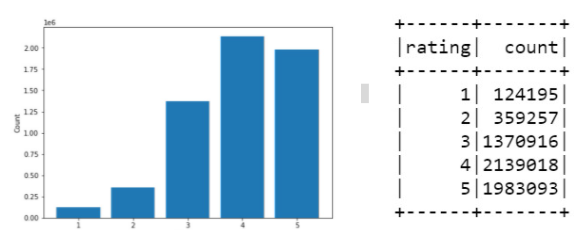

# BOOK RECOMMENDATION SYSTEM (Group 10)

The goal of this project is to develop a book recommendation system to assist the users by suggesting books of their relevant interests as well as predicting the user rating for a particular book. This requirement will be fulfilled using the Content-based and collaborative filtering approaches.

## Research questions
<ol>
    <li>Can we predict the rating of a particular book by a given user?</li>
    <li>How does each model perform compared to the other?</li>
</ol>

## Dataset: goodbooks-10k
Reference: https://github.com/zygmuntz/goodbooks-10k/blob/master/quick_look.ipynb

## books.csv (10000 records):metadata for each book
    - book_id (numeric)
    - authors (text)
    - original_publication_year (number)
    - original_title (text): the title of the book
    - language_code (text): the 3 characters of the book's language code
    - average_rating (numeric)
    - ratings_count (numeric)
    - ratings_[1 to 5] (numeric)

### ratings.csv (5976479 records): Contains rating information from users for books
    - user_id (numeric)
    - book_id
    - rating (numeric): range [1, 5]

### book_tags.csv (5976479 records): Contains the id of tags assigned by users to books
    - goodreads_book_id (numeric)
    - tag_id (numeric)
    - count (numeric): Number of users that labeled the book with this tag.

## Data Preprocessing
### Data Cleaning
The **ratings** dataset does not contain any null or invalid values, hence no data cleaning is required. However, the book and book tag dataset include multiple null and invalid data.

### Data Imbalance
As illustrated in fig 1, there is a data imbalance, with the rating values (e.g., 1, 2) being very low. Therefore, we will look at various techniques (Resample, k-fold cross-validation, etc ) for dealing with data imbalance.

<em>Fig 1:</em> illustrates the data imbalance in our dataset

## Model 1: Content-based
*Advantage*: No cold start, able to recommend new and unpopular books  
*Disadvantage*: Difficult to recommend to new users

### One-Hot Vector Encoding
To deal with categorical data, we will do One-hot vector encoding to build our item and user profile.

### Algorithm
Using cosine distance, recommend books to users similar to previous books highly rated by the user.
* Item profile: The item profile will be built with a column having values ranging from 0 to 1 for each distinct category of the book features.
* User profile: The user profile will be the aggregate of the item profiles of books that have been highly rated by the user, normalized to the range 0-1.

## Model 2: Collaborative Filtering
*Advantage*: Feature selection is not needed, helps users discover new interests.  
*Disadvantage*: Cold start problem, popularity bias

### Algorithms
Matrix Factorization - Generate latent features and identify relationships between users and items based on other user’s interactions.

## Evaluation metrics 
* Root mean squared error
* Confusion Matrix

# IMPLEMENTATION
All of our works have put in `model` folder following the structure:
- [G10_Data_Cleaning_and_Preprocessing](https://github.com/nerostamas/SOEN-6111-Big-data-project-group/blob/main/model/G10_Data_Cleaning_and_Preprocessing.ipynb): contains all preprocessing steps for cleaning and combining data before build models
- [G10_Content_Based_Model_1](https://github.com/nerostamas/SOEN-6111-Big-data-project-group/blob/main/model/G10_Content_Based_Model_1.ipynb): contains all steps to train and evaluation for `Content-based` model with `one-hot vector`
- [G10_MF_using_ALS_Model_2](https://github.com/nerostamas/SOEN-6111-Big-data-project-group/blob/main/model/G10_MF_using_ALS_Model_2.ipynb): contains all steps to train and evaluation for `Collaborative Filtering` model
